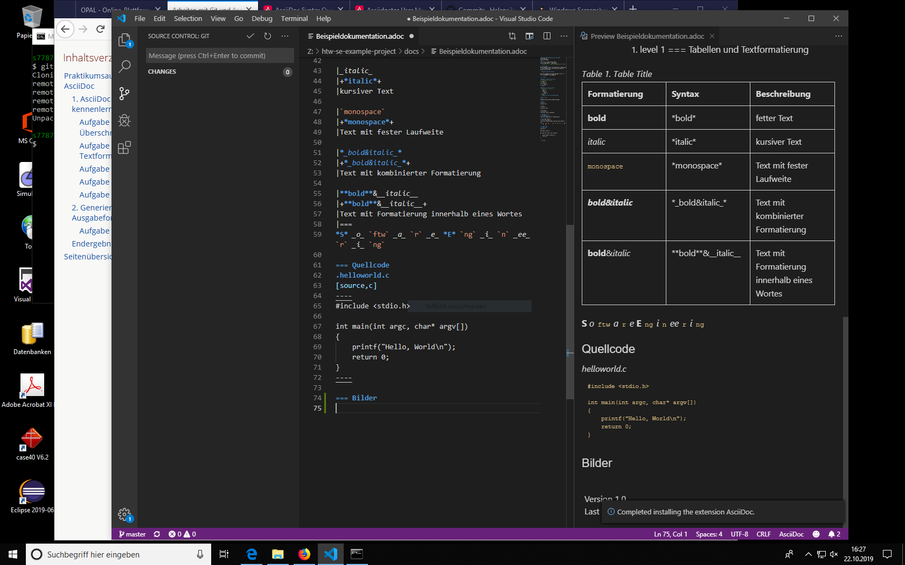

= Beispiel-Dokumentation mit AsciiDoc
Helene Uhlig
1.0, 01.09.2019 
:toc:
:toc-title: Inhaltsverzeichnis
source-highlighter: highlightjs
// Platzhalter für weitere Dokumenten-Attribute

== Einführung
Diese Dokument dient im Praktikum als Spielwiese für das Kennenlernen und praktische Üben der Syntax von AsciiDoc.

== Kennenlernen der Syntax

Über die Aufgaben wird das Dokument Stück für Stück aufgebaut und angepasst.

=== Listen

.Beispiel: unsortierte Liste 
// Platzhalter* level 1
** level 2
*** level 3
**** level 4
***** level 5
* level 1

.Beispiel: sortierte Liste
// Platzhalter. level 1
.. level 2
... level 3
.... level 4
..... level 5
. level 1
=== Tabellen und Textformatierung

.Table Title
|===
|Formatierung |Syntax |Beschreibung

|*bold*
|+*bold*+
|fetter Text

|_italic_
|+*italic*+
|kursiver Text

|`monospace`
|+*monospace*+
|Text mit fester Laufweite

|*_bold&italic_*
|+*_bold&italic_*+
|Text mit kombinierter Formatierung

|**bold**&__italic__
|+**bold**&__italic__+
|Text mit Formatierung innerhalb eines Wortes
|===
*S* _o_ `ftw` _a_ `r` _e_ *E* `ng` _i_ `n` _ee_ `r` _i_ `ng`

=== Quellcode
.helloworld.c
[source,c]
----
#include <stdio.h>

int main(int argc, char* argv[])
{
    printf("Hello, World\n");
    return 0;
}
----

=== Bilder

=== Verweise
<<.helloworld.c>>
<<Beispiel-Dokumentation mit AsciiDoc>>
